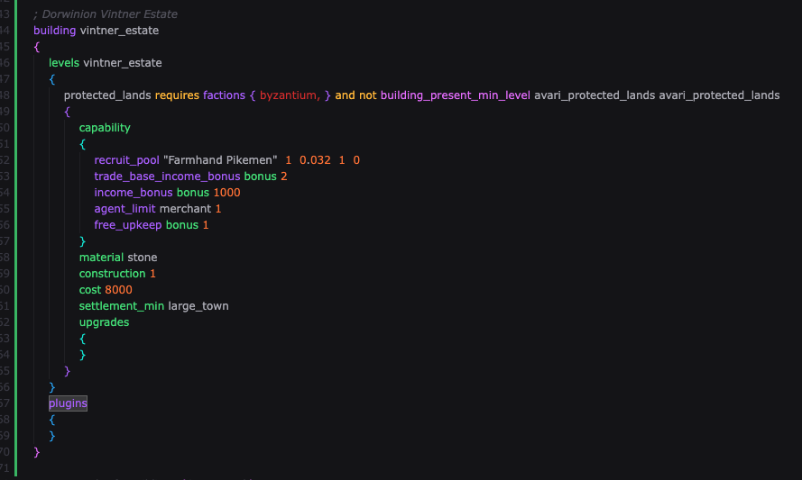

## TW Script
Visual Studio Code language extension for working with Medieval 2 files

## Acknowledgements
* Belovese (.belovese) from SSHIP/Insularis Draco for the original files. This is a fork.

## Currently Supported Files
- campaign_script.txt
- export_descr_buildings.txt
- export_descr_ancillaries.txt
- export_descr_character_traits.txt
- export_buildings.txt
- export_ancillaries.txt
- export_traits.txt
- export_vnvs.txt
- descr_strat.txt

## Installation
Simply download the .vsix file and install using the `Extensions: Install from VSIX` option

## Usage
Specify the language-mode for files to be `tw-script`

## Development
Bump the version in `package.json` and run `vsce package` (Install it if you don't already have it)